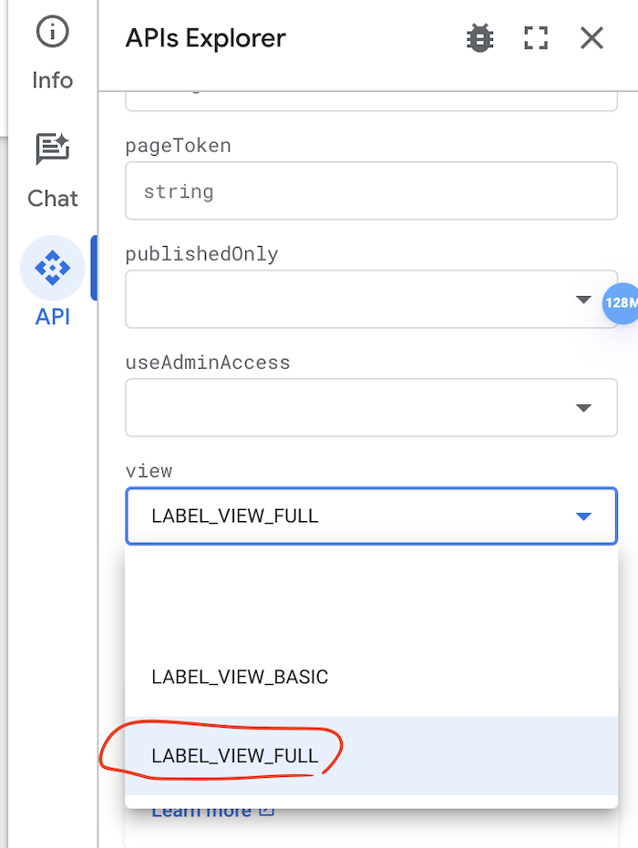

# Purpose

- A tool for Google Workspace Manager to apply labels recursively to any specified folder.
- Google Drive folder is not an "actual" folder, to apply labels like "Classified" or "Restricted" on files you need to navigate into each folder and select manually 100 files at most.
- This tool can save you lots of time if you're also going through ISO27001 verification process.

- The **"Classified", "Restricted"** labels you created from Google Drive UI is actually via Google Label API v2. In order to show highlighted **"Classified"** as ISO27001 requested, you need to specify selection id of the label.

- You can find out LabelID, FieldID and SelectionID from here [v2 label API](https://developers.google.com/drive/labels/reference/rest/v2/labels/list) opened via browser and login with workspace account. Click on "Try it!"


- The tricky part is select view = **"LABEL_VIEW_FULL"** in order to see all attributes.

- Then you get responses like including LabelID, FieldID and SelectionID:

```json
{
  "name": "labels/s6O**************Fcb@22",
  "id": "s6O**************Fcb",
  "revisionId": "22",
  "labelType": "ADMIN",
  "creator": {
    "person": "people/10*******77"
  },
  "createTime": "2023-12-04T01:56:59.455162Z",
  "revisionCreator": {
    "person": "people/10*******77"
  },
  "revisionCreateTime": "2024-03-28T02:31:15.952314Z",
  "publisher": {
    "person": "people/10*******77"
  },
  "publishTime": "2024-03-28T02:31:15.952314Z",
  "customer": "customers/C*******h",
  "properties": {
    "title": "Data classification",
    "description": "According to ISO Data classification process, documents should have correct labels."
  },
  "lifecycle": {
    "state": "PUBLISHED"
  },
  ...  
  "fields": [
    {
      "id": "<field-id>",
      "queryKey": "labels/s6O**************Fcb",
      "properties": {
        "displayName": "Classification level"
      },
      ...
      "selectionOptions": {
        "choices": [
          {
            "id": "<selection-id-1>",
            "properties": {
              "displayName": "Classified",
              "description": "Including source code, patents, business plans, bank accounts, transaction data etc.",
              ... }        
          },
          {
            "id": "<selection-id-2>",
            "properties": {
              "displayName": "Restricted",
              "description": "Only for selected role. Including Project documents, Customer data, contracts, resume, payroll and documents including personal information.",
              ... }
          },
          {
            "id": "<selection-id-3>",
            "properties": {
              "displayName": "NORMAL",
              "description": "Process Documents, Product Categories, etc.",
              ... }
          }
      	  ]
      }
    }
  ]
}
```

# Setup

- To obtain your **credentials.json**, go to `https://console.cloud.google.com/apis/credentials` and create **"OAuth Client ID"**. We're not publishing the application so consent screen is not required.
- Enable Google Drive API and Drive Labels API.
- Download secret and rename to **credentials.json** 
- Need **.NET** to run this code with latest Google Drive API v3 and Google Label API v2. 
- For macOS, download `https://dotnet.microsoft.com` LTS version e.g. 8.0
Choose macOS arm64 or x86 depends on your machine.

```
dotnet add package Google.Apis.Drive.v3 --version 1.67.0.3373
dotnet add package Google.Apis.DriveLabels.v2 --version 1.67.0.3273
```

# Run

- FolderID is the the last part of Google Drive url `https://drive.google.com/drive/u/0/folders/<folder-id>`. Then you can run the code, login with workspace account and allow access. Don't worry, the application is created by you (**"OAuth Client ID"**) not me.
- The code works as recursively go through folders and keep a list of files to label, then slowly call modify label API to avoid rate limit of API. Free to sleep less for acceleration. 

```bash
dotnet run <label-id> <field-id> <selection-id> <folder-id>
```


